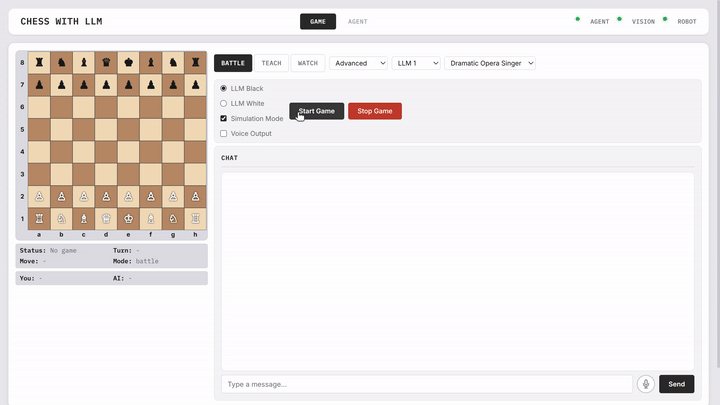

[繁體中文版本](README.zh-TW.md)

# Chess with LLM

**An LLM-first chess AI agent framework — three game modes, character-driven dialogue, and pluggable hooks for vision and a robotic arm.**

<!-- HERO GIF: signature shot of the physical arm picking up a piece (3–6s, 720px wide)
<p align="center">
  
</p>
-->

---

## Three Modes

| Mode | Who's playing | Dialogue | Physical mode |
|------|--------------|----------|---------------|
| **Battle** | You vs AI (Stockfish or LLM picking moves) | LLM comments on each move in character | Optional: real arm or simulation only |
| **Teach** | You follow a lesson | LLM coach delivers it in three phases | Optional: real arm or simulation only |
| **Watch** | LLM vs LLM | Both LLMs comment in their own voice | Simulation only |

---

## Battle Mode — LLM-Driven × Physical Arm
                                        
<p align="center">                                                                                                                
                                         
  </p>             
***How the AI decides what to play***

The Battle mode `think` node supports two move-decision modes:

```text
FEN + move history
       │
       ▼
  Move decision mode
       │
       ├─ Stockfish picks the move
       │     └─ Stockfish produces suggested_move from the current position
       │
       └─ LLM picks the move
             └─ LLM produces suggested_move from board, history, character & difficulty
       │
       ▼
  suggested_move (UCI)
       │
       ▼
  LLM writes a comment on the move
```

The agent's core move can come from Stockfish (LLM only narrates), or from the LLM directly (character and difficulty influence every move more deeply).

The UI lets you pick **Stockfish / LLM 1 / LLM 2 / LLM 3** as your opponent engine. LLM 1–3 are three preconfigured slots — point each at any provider/model so you can swap models, characters, or playstyles on the fly.

After every move, the LLM drops a one-line comment. The tone follows whatever **character** you've set.

***Character × Commentary × Voice***

`services/agent/conversation/modes.py` matches free-text character descriptions ("trash-talking pirate", "zen master", "street rapper") against keyword archetypes, then maps them onto CosyVoice emotion presets. (You can swap the voice API; CosyVoice run locally gives the lowest latency.)

The result: AI opponents not only play, they comment on each move in a tone consistent with the persona, with TTS that matches.

| Game event | Trash-talking pirate | Zen master |
|------------|---------------------|------------|
| Check | `angry`, taunting, intense pressure | `serious`, calm reminder |
| Checkmate | `angry + happy`, manic victory speech | `calm`, end the game with composure |
| Capture | `happy`, gloating mockery | `gentle`, peacefully explains the trade |
| Normal move | `disgusted`, snarky muttering | `calm`, steady analysis |

***Vision + Robot Hookup***

The agent architecture is built so you can wire in **a vision system** and **a robotic arm** later, taking the game off the screen and onto a real board.

End-to-end flow:

```text
Human moves
   │
   ▼
RealSense detects board changes
   │
   ▼
Identify which move the human made
   │
   ▼
AI Agent / LLM picks the response
   │
   ▼
Convert to UCI move
   │
   ▼
Robot service translates to arm motion
   │
   ▼
Interbotix RX-200 executes pick / place / capture
```

<!-- ROBOT GIF: Battle mode physical pick → move → place (6–10s, 720px, split-screen with UI) -->

> The 6-stage vision pipeline, AprilTag hand-eye calibration, 64-square teaching, IK search strategy, capture/promotion handling, and full YAML reference are all in **[docs/ROBOT.md](docs/ROBOT.md)**.

---

## Teach Mode — AI Generates the Curriculum

The core idea: **the teaching topic and lesson outline can be authored by AI**, expanded into a sequence of steps automatically.

Each step has a single teaching focus — AI explains the concept, demonstrates the move, then guides the student to do it themselves.

<!-- SCREEN GIF: Teach mode three phases illustrate → demo → ending → explanation, 8–12s, 720px -->

Lessons live in YAML files under `lessons/*.yaml`. Each step can carry a fixed three-phase narrative:

```yaml
lesson_id: 01_meet_the_pieces
title_en: "Meet the Pieces"
difficulty: beginner
steps:
  - fen: "rnbqkbnr/pppppppp/8/8/8/8/PPPPPPPP/RNBQKBNR w KQkq - 0 1"
    expected_move: "e2e4"
    instruction: "Teach the student basic pawn moves and guide them to push e2 to e4."
    illustrate_en: "The pawn is the smallest but bravest piece on the board. It moves one square forward, but on its first move it can jump two."
    demo_narration_en: "See, I'm pointing at the e2 pawn. It can move forward two squares to e4."
    ending_en: "Your turn — push the e2 pawn to e4."
    hints_en: ["Click the pawn on e2, then click e4"]
    explanation_en: "Nice! Your pawn now controls the center. Pawns move straight but capture diagonally."
```

Lesson flow:

```text
illustrate              demo                      ending
─────────────          ─────────────────         ──────────────────
AI explains concept ──▶  AI / arm demonstrates ──▶ Student plays
(set up the focus)       (point or play it)        Student moves → system validates
                                                       │
                                                       ├─ Correct → AI praises + adds context + next step
                                                       └─ Wrong   → AI gently corrects + hints + retry
```

The goal of each step isn't just "make the student play one move" — it's a complete pedagogical interaction:

1. **illustrate**: explain the concept this step teaches
2. **demo**: demonstrate the correct move (optionally with the arm pointing)
3. **ending**: ask the student to act
4. **validation**: check whether the student moved correctly
5. **explanation**: praise, hint, or expand depending on the result

---

### AI Auto-Fills Missing Lesson Content

YAML lessons don't have to spell out every narrative field.

If `illustrate_en` / `demo_narration_en` / `ending_en` / `explanation_en` aren't pre-written, the LLM generates them on the fly from `instruction`, current FEN, target move, and lesson difficulty.

That means a lesson author can supply just the bare minimum:

```yaml
steps:
  - fen: "rnbqkbnr/pppppppp/8/8/8/8/PPPPPPPP/RNBQKBNR w KQkq - 0 1"
    expected_move: "e2e4"
    instruction: "Teach the student that a pawn's first move can be two squares; guide them to play e2-e4."
```

…and the AI will fill in:

- The concept explanation
- The demo narration
- The student's instruction
- The hints
- The post-move follow-up

Course designers don't have to write every line of dialogue — just the **teaching intent**, and AI grows it into a full interactive lesson.

---

## Watch Mode — AI vs AI

Watch Mode lets two LLMs play each other.

I know — **an LLM is never going to beat a dedicated chess engine like Stockfish**. But I was curious anyway: how well can a general-purpose language model actually play if no one tunes it for chess?

So Watch Mode exists to put different LLMs head-to-head and observe their differences in board understanding, tactical judgment, error rates, and play style.

<!-- SCREEN GIF: Watch mode LLM vs LLM, dual chat labels + move highlight, 8–12s, 720px -->

The basic loop:

```text
White: LLM 1 + character
Black: LLM 2 / LLM 3 + character

loop:
  read current board state
  determine whose turn it is
  call that side's LLM to produce the next move
  execute the move
  that side's LLM comments in character
  update board state and check for end conditions
```

Each side can run a different LLM provider, model, and character. For example:

```text
White: LLM 1, zen master
Black: LLM 3, street rapper
```

When white plays, white's model and character generate both the move and the commentary. Same for black. It's not one narrator commenting on both sides — it's two AI players speaking with their own voices.

---

### LLM Head-to-Head

I also used Watch Mode to test the flagship models from the three big providers, with difficulty set to master and personality set to professional player.

**GPT 5.5 vs Claude Opus 4.7**

| # | white | black | winner |
|---|-------|-------|--------|
| 1 | gpt-5.5 | claude-opus-4-7 | claude-opus-4-7 |
| 2 | claude-opus-4-7 | gpt-5.5 | draw |
| 3 | gpt-5.5 | claude-opus-4-7 | draw |
| 4 | claude-opus-4-7 | gpt-5.5 | claude-opus-4-7 |

**GPT 5.5 vs Gemini 3.1**

| # | white | black | winner |
|---|-------|-------|--------|
| 1 | gpt-5.5 | gemini-3.1-pro | gemini-3.1-pro |
| 2 | gemini-3.1-pro | gpt-5.5 | gemini-3.1-pro |
| 3 | gpt-5.2 | gemini-2.5-pro | draw |
| 4 | gemini-2.5-pro | gpt-5.2 | gemini-3.1-pro |

**Claude Opus 4.7 vs Gemini 3.1 Pro**

| # | white | black | winner |
|---|-------|-------|--------|
| 1 | claude-opus-4-7 | gemini-3.1-pro | gemini-3.1-pro |
| 2 | gemini-3.1-pro | claude-opus-4-7 | gemini-3.1-pro |
| 3 | claude-opus-4-7 | gemini-3.1-pro | gemini-3.1-pro |
| 4 | gemini-3.1-pro | claude-opus-4-7 | gemini-3.1-pro |

> Note: games over 100 plies that devolve into chasing each other in the endgame are scored as draws.

So far in testing, **Gemini is meaningfully stronger at chess** than the others.

---

## Quick Start (Simulation Mode)

No hardware required — runs anywhere. The whole LLM setup happens in the web UI; **no environment variables needed**.

### 1. Clone and start the services

```bash
git clone https://github.com/<you>/chess-with-llm.git
cd chess-with-llm
docker-compose up
```

### 2. Open the API Settings panel

Browser to `http://localhost:8000`, click **API Settings** in the top-right.

There are three LLM slots (LLM 1 / LLM 2 / LLM 3). Just one of them is enough to play — fill all three and you can switch between or pit them against each other in Battle and Watch modes.

### 3. Recommended provider settings

| Slot | Model | Base URL | API key |
|------|-------|----------|---------|
| **OpenAI** | `gpt-5.5` | `https://api.openai.com/v1` | [platform.openai.com](https://platform.openai.com/api-keys) |
| **Gemini** | `gemini-3.1-pro-preview` | `https://generativelanguage.googleapis.com/v1beta/openai/` | [Google AI Studio](https://aistudio.google.com/apikey) |
| **Claude** | `claude-opus-4-7` | `https://api.anthropic.com/v1/` | [console.anthropic.com](https://console.anthropic.com/settings/keys) |

Hit **Save** — settings are persisted to `agent_settings.yaml` and reloaded on next startup.

### 4. Start a game

Back to the main page, check **Simulation Mode**, pick **Battle / Teach / Watch**, type any character ("trash-talking pirate", "zen master", whatever), hit **Start Game**.

> **Want to plug in the real arm?** The full hardware build needs an Interbotix RX-200 + RealSense D435, with first-time AprilTag hand-eye calibration and 64-square teaching. The complete physical setup, calibration walkthrough, and API contract are in **[docs/ROBOT.md](docs/ROBOT.md)**.

---

## Build Your Own Robot

The agent isn't tied to RX-200. Vision and Robot are just FastAPI services — to wire in a UR5, DOBOT, or homebrew arm, implement a handful of REST endpoints:

```
Vision:  POST /capture/occupancy   → occupancy + colour
Robot:   POST /manual_pick         {square, piece_type}
         POST /manual_place        {square, piece_type}
         POST /capture             {square, piece_type}
         POST /arm/{work,vision}
```

**Full API contract, request/response schemas, reference implementation details** → [docs/ROBOT.md](docs/ROBOT.md)

No hardware? Run `docker-compose -f docker-compose.virtual.yaml up` — vision + robot go through mocks, the clickable board + LLM + voice all still work, and it's perfect for testing your own implementation.

---

## System Architecture

An AI Agent stitched together from **LLM, chess engine, vision, and robotic arm**.

```text
Browser UI
   │
   │ WebSocket / REST
   ▼
Agent Server :8000
   │
   ▼
LangGraph State Machine
   │
   ├─ observe
   ├─ detect_change
   ├─ think
   ├─ act
   ├─ verify
   └─ voice_announce
   │
   ├──────────────► Stockfish
   │
   ├──────────────► LLM Service
   │                 OpenAI / Gemini / Claude
   │
   ├──────────────► Vision Service :8001
   │                 RealSense D435
   │
   └──────────────► Robot Service :8002
                     Interbotix RX-200 + ROS
```

This isn't a chess UI — it's a complete **AI Agent + Vision + Robot** physical-interaction system.

---

## Multi-Provider LLM Compatibility Layer

`services/agent/conversation/llm_service.py` — `_detect_provider()` + `_build_optional_params()` handle the per-provider quirks:

| Provider | Token param | Temperature | Streaming |
|----------|-------------|-------------|-----------|
| OpenAI | `max_completion_tokens` | only on non-reasoning models | ✓ |
| Claude | `max_tokens` | ✗ (deprecated on Opus) | ✓ |
| Gemini | `max_tokens × 10` (thinking eats budget) | ✓ | only on non-thinking models |
| OpenRouter | `max_tokens` | ✓ | ✓ |

All three slots are configured through the **API Settings** panel in the UI and stored in `agent_settings.yaml`. No environment variables required.

---

## Voice Stack

```
Microphone
  │
  ▼
VAD (detects speech boundaries, filters out "um" / "嗯" / Whisper hallucinations)
  │
  ▼
Whisper STT ──▶ IntentRouter classifies as:
                  MOVE / MODE_SWITCH / LANGUAGE_SWITCH /
                  GAME_COMMAND / CONVERSATION / IGNORE
  │
  ▼
LangGraph node corresponding to the intent
  │
  ▼
LLM response (streaming)
  │
  ▼
TTS (OpenAI / CosyVoice with emotion preset) ── WebSocket sentence-by-sentence ──▶ Browser
```

CosyVoice can be deployed on a remote GPU machine; the agent calls it over HTTP. The 0.5B model is light enough but emotional expression is noticeably better than OpenAI TTS.

---

## Project Layout

```
services/
  agent/                   # The brain :8000
    main.py                   FastAPI, game flow, LLM service switching
    conversation/
      llm_service.py            multi-provider compat layer
      modes.py                  character × emotion × mode prompts
      intent_router.py          STT → intent classification
    audio/
      stt_service.py            Whisper
      tts_service.py            OpenAI TTS
      tts_cosyvoice.py          CosyVoice client
    websocket/                voice_handler, bidirectional streaming
    static/                   vanilla JS web UI (game/vision/robot/agent tabs)
    lessons.py                YAML lesson loader
    board_setup.py            automatic board setup algorithm

  vision/                  # The eyes :8001
    main.py                   FastAPI wrapping chess_vision

  robot/                   # The hand :8002
    main.py                   ROS + Interbotix, pick/place/capture

chess_vision/              # Vision library (camera-agnostic)
  vision_pipeline.py          6-stage pipeline coordinator
  chess_algo.py               YOLO detection + colour classification
  board_state.py              square mapping, FEN generation
  camera.py                   BaseCamera ABC + RealSense impl
  handeye_calibration.py      AprilTag hand-eye calibration

rx200_agent/               # LangGraph agent
  graph.py                    state machine assembly
  state.py                    AgentState TypedDict
  nodes/
    observe.py                vision snapshot
    detect_change.py          occupancy delta detection
    think.py                  LLM / Stockfish move selection
    act.py                    UCI → robot
    voice_announce.py         in-character voice commentary
    error_handler.py          error routing
  board_tracker.py            colour-filtered move detection

lessons/                          # YAML lessons
docker-compose.yaml               # default = virtual (agent only)
docker-compose.virtual.yaml       # explicit virtual mode
docker-compose.physical.yaml      # full hardware: agent + vision + robot
```

---

## Tech Stack

| Layer | Tech |
|-------|------|
| Agent | FastAPI, LangGraph, python-chess, Python 3.10 |
| LLM | OpenAI GPT-5.x, Google Gemini 3.x, Anthropic Claude 4.x, Stockfish 16 |
| Vision | YOLOv8 (segment + detect), OpenCV, Intel RealSense D4xx |
| Voice | Whisper STT, OpenAI TTS, CosyVoice (emotion preset) |
| Robot | ROS 1 Noetic, Interbotix SDK, Dynamixel |
| Calibration | AprilTag (pupil-apriltags), least-squares hand-eye fit |
| Frontend | vanilla JS, WebSocket, MJPEG |
| Deployment | Docker Compose, volume-mounted YAML configs |

---

## License

MIT
